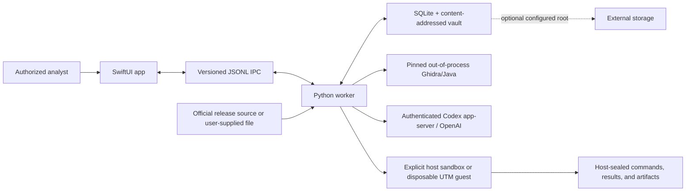

# DiffSearchVuln threat model

## Purpose and scope

DiffSearchVuln is a personal, local, macOS-first workbench for authorized
patch-diffing and bug-bounty research. It helps an analyst preserve adjacent
release artifacts, compare matching Apple Silicon Mach-O binaries with Ghidra,
rank security-relevant changes through reproducible Codex tournaments, explain
the vulnerable-before and patched-after behavior, and run explicitly approved
old/new validation tests inside a contained local lab.

The application is evidence infrastructure. It is not a vulnerability scanner
for live third-party services, an autonomous exploit launcher, a malware
detonation service, or proof that a model-generated hypothesis is a confirmed
finding. Static analysis is the default. Imported binaries execute only after
the user starts a dynamic campaign from Findings.

## Intended users

| User | Goal | Expected authority and knowledge |
| --- | --- | --- |
| Independent vulnerability researcher | Localize security patches, investigate residual bypasses, and prepare reproducible internal evidence | Owns or is authorized to analyze the release artifacts and understands safe local testing and disclosure obligations |
| Vendor or project security engineer | Validate a shipped fix, test regressions, and review the exact binary behavior users received | Authorized by the software owner and able to evaluate source, release, and remediation context |
| Security reviewer or research lead | Audit provenance, tournament decisions, failed tests, dynamic proof, and novelty claims | Reviews evidence but need not execute targets |
| Workbench operator | Configure Python, Ghidra, Java, storage, the local worker, Codex authentication, and optional UTM | Controls the dedicated research Mac and its analysis data |

The app is not designed for untrusted multi-tenant use. A person who can use the
development build inherits substantial access to the current macOS account and
must be treated as a trusted local operator.

## Security goals

1. Import and static analysis must never execute hostile target code.
2. Old, patched, and latest artifacts must remain bound to their recorded
   source, architecture, channel, parent archive, and SHA-256 identity.
3. Untrusted binary/decompiler content must remain data and never become agent
   instructions.
4. Dynamic execution must require a deliberate user action and remain inside
   the selected no-network host sandbox or disposable UTM guest.
5. A result must distinguish static evidence, model inference, observed target
   behavior, failed tests, and researcher conclusions.
6. Evidence must be recoverable and tampering or identity rebinding must be
   detectable.
7. Codex and reports must receive only the evidence needed for the active
   analysis; credentials and unrelated user data must not enter prompts or
   audits.
8. No external report or disclosure should occur without a complete review and
   explicit user approval.

## Assets to protect

- The research Mac, its user files, credentials, Keychain, and authenticated
  Codex session.
- Imported releases, original archives, derived slices, Ghidra projects,
  symbol maps, semantic diffs, tournament records, dynamic fixtures, and test
  artifacts.
- SQLite product/release/job metadata and the content-addressed artifact vault.
- Confidential or embargoed vulnerability hypotheses, proof details, novelty
  searches, vendor drafts, and disclosure timelines.
- Evidence integrity: artifact hashes, tool versions, prompts, decisions,
  failures, commands, stdout/stderr, and sealed dynamic audits.
- Availability of local and external storage, analysis caches, and long-running
  jobs.

## Data flow and trust boundaries

The primary boundaries are:

- untrusted release bytes entering the worker and analysis toolchain;
- the native UI crossing into the local Python worker through strict IPC;
- selected decompiled evidence leaving the Mac for Codex processing;
- an explicit dynamic campaign crossing from analysis into target execution;
- large evidence roots crossing onto removable storage;
- internal findings crossing into an external disclosure process.

## Threat actors and failure sources

- A malicious or compromised release artifact crafted to exploit Mach-O
  parsing, Ghidra, helper tools, archive extraction, or the dynamic lab.
- Malicious strings or decompiler output containing prompt injection intended
  to redirect Codex or falsify a finding.
- A compromised mirror, mutable release tag, or incorrect source pairing that
  substitutes artifacts or architectures.
- A malicious local process or other account attempting to alter evidence,
  replace a staged target, inspect embargoed findings, or interfere with a lab.
- A compromised or misconfigured Ghidra, Java, Python, Codex CLI, UTM, or other
  dependency.
- Incorrect or adversarial model output: fabricated evidence, weak relative
  winners, unsafe commands, overclaimed impact, or failure to distinguish an
  expected behavior from a bypass.
- Analyst error or misuse: choosing an unauthorized target, running an old
  binary outside containment, exposing secrets to Codex, treating a simulation
  as proof, or disclosing prematurely.
- Resource exhaustion from oversized binaries, pathological decompilation,
  large IPC records, disk exhaustion, process hangs, or hostile target output.

## Threats, controls, and residual risk

| Threat | Existing control | Residual risk / required practice |
| --- | --- | --- |
| Target executes during import or diffing | Inventory, hashing, thinning, Ghidra export, diffing, and tournaments are static; execution is not an import side effect | Parsers and Ghidra still process hostile bytes and may contain vulnerabilities |
| Wrong binary, architecture, or release is analyzed | Original archives and derived binaries are SHA-256 bound; parent links, Mach-O UUIDs, signatures, channel, and exact architecture are recorded; mismatched Ghidra languages are rejected | Source authenticity still depends on the acquisition channel and analyst verification |
| Artifact or database identity is silently rebound | Content-addressed vault, immutable artifact identities, parent constraints, cached-run validation, and preserved failures | A fully compromised local account can alter files and metadata; records are not externally signed or timestamped |
| Prompt injection in binary text | Prompts declare binary/decompiler material untrusted; tournament inputs are schema-bound and isolated; structured identities and ranks are validated | Models can still reason incorrectly; a human must review evidence before promotion |
| Codex receives unrelated secrets | Candidate-scoped evidence is sent; source credentials are excluded from database, logs, reports, and Codex context | Decompiled proprietary content and local path metadata may still leave the Mac; use only where remote processing is authorized |
| Malformed IPC confuses the app or worker | Version/correlation validation, unknown-field rejection, one-request-at-a-time Swift client, 1 MiB request and 64 MiB response ceilings, typed errors | The local worker runs with the user's account privileges in the development build |
| Helper path traversal or artifact escape | Safe relative-path validation, symlink rejection, regular-file and size checks, hash verification, and writable-attempt boundaries | Shell-based dynamic helpers remain powerful inside the lab and require evidence review |
| Host compromise during dynamic proof | Explicit Findings action, old/new hash checks immediately before execution, network denial, user-file read denial, lab-confined writes, sanitized environment, time/resource limits, and sealed audit | `sandbox-exec` is weaker than a VM and is platform/deprecation sensitive; use the disposable UTM mode for higher-risk targets |
| Guest persists or reaches host/network | UTM guest must be stopped, macOS, networkless, and without host directory sharing; it launches as a disposable snapshot and is forcibly discarded | UTM and its guest agent are trusted dependencies; cleanup failure requires operator intervention |
| Evidence is deleted because a test failed | Failed, partial, and no-strong-candidate runs are retained; cached outputs are revalidated | Retention can consume substantial disk; storage exhaustion can interrupt later work |
| External disk is missing or replaced | Architecture calls for stable volume identity, security-scoped bookmarks, capacity reserve, and pause rather than fallback | This workflow is not fully implemented in the current native app |
| Credentials leak | Keychain-backed source credentials are the intended design and credentials must never enter prompts or records | Release tracking and Keychain integration are not complete; operators must not place secrets in case notes or advisory text |
| Finding is overclaimed or disclosed prematurely | Exact evidence labels, old/new/latest controls, repeatability, negative controls, novelty checks, and explicit approval before external reporting | Novelty searches are bounded and cannot prove the absence of private reports |

## Misuse cases and prohibited workflows

- Do not probe or exploit live external systems, user accounts, cloud tenants,
  or networks merely because their software version appears affected.
- Do not execute imported old or patched binaries outside the explicit contained
  campaign.
- Do not use the app to establish persistence, evade detection, exfiltrate data,
  deploy malware, or create an operational weapon.
- Do not paste credentials, private keys, customer data, unrelated proprietary
  code, or embargoed information into advisory text or Codex instructions.
- Do not label an internal `bypass_reproduced` enum, a crash, a marker created by
  setup code, or a model conclusion as a confirmed vulnerability without the
  required behavioral and novelty evidence.
- Do not submit a vendor report until the target, recipient, evidence bundle,
  impact, prerequisites, affected-version bounds, attachments, and disclosure
  plan have been reviewed and explicitly approved.

## Current development limitations

- The native development target has App Sandbox disabled so it can launch the
  Homebrew Python worker and read user-selected analysis paths. It is therefore
  not safe for untrusted local users and is not the intended release posture.
- Release tracking, complete job control, Keychain integration, security-scoped
  external-storage bookmarks, signing, notarization, and packaging remain
  incomplete.
- Host dynamic mode relies on macOS `sandbox-exec`; the optional disposable UTM
  guest is the stronger isolation boundary.
- Codex is a remote processing boundary. Model output is advisory until exact
  local evidence and the required workflow promote it.
- Diff ranking and decompilation can miss or misinterpret optimized,
  architecture-specific, cross-component, data-only, or heavily inlined fixes.
- The app is single-operator evidence tooling, not a hardened multi-user case
  management or disclosure platform.

## User checklist

Before analysis:

- Confirm authorization, target scope, disclosure rules, release source, and
  whether evidence may be processed by Codex.
- Use a dedicated research Mac or a stronger isolated guest and verify storage
  capacity.
- Record official hashes and keep old/new architecture and channel identical.

Before dynamic testing:

- Review the selected hypothesis and fixtures, deliberately press **Start
  Dynamic Tests**, and confirm the no-network lab boundary.
- Prefer UTM when the target or parser risk exceeds the host-sandbox assumption.
- Ensure setup commands cannot create the claimed target-side effect.

Before reporting:

- Recheck exact labels, latest-version proof, fresh repetitions, negative
  controls, attacker prerequisites, affected-version bounds, novelty scope, and
  every attached hash.
- Keep the report local until the user explicitly approves the recipient and
  disclosure plan.
